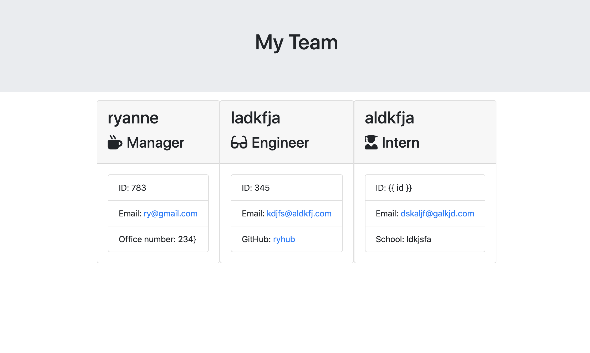

**Team Profile Generator**

  ## **Description**
  * This application generates a team profile using the command line. It allows you to input information about the team manager, engineer or intern. It asks for team member IDs and returns an error if a number is not put in. It asks for members emails and returns and error if "@something.com" is not put it. 
  
  ## **Table of Contents**
  ### [Installation](#Installation)
  ### [Usage](#Usage) 
  ### [Contributing](#contributing)
    
  ## Installation
  Installation process for the project: type node Index.js into the command line
  
  ## Usage
 
 Here is a quick demonstration of this project: https://drive.google.com/file/d/1LNwD20XZLeGArcqKj1DeGl7L2RPC4c9W/view
  
  
  ## **License:**
  This project is protected under the MIT license.

  ## Contributing
  npm inquirer package
  
  ## **Tests**
  type node Index.js into the command line and answer all of the quetions. The answers will be formulated into an html that you can view.
  
  ## **Questions**
  * Visit me at [gitHub](http://www.github.com/ryannekillian)
  * For additional questions, please reach me at: ryanne.killian@gmail.com
  
  
